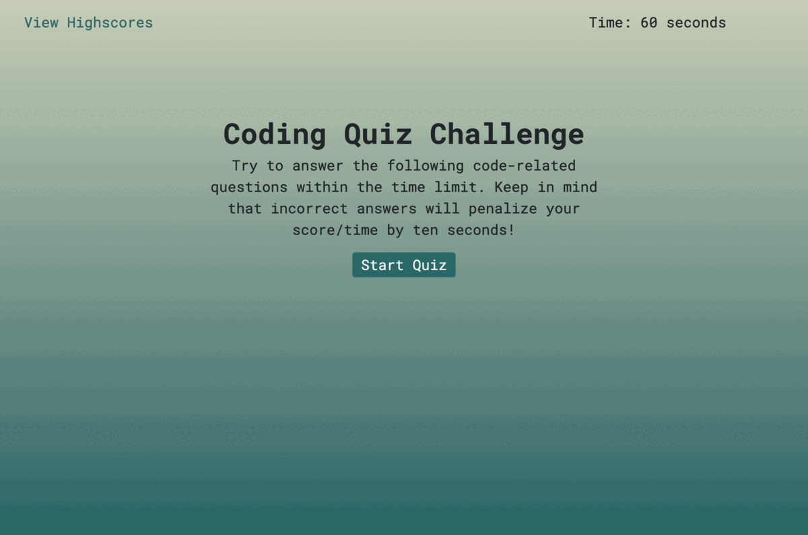

# Code Quiz

## Table of contents

- [About the project](#about)
  - [User Story](#user-story)
  - [Screenshot](#screenshot)
  - [Links](#links)
- [My process](#my-process)
  - [Built with](#built-with)
  - [Useful resources](#useful-resources)
- [Author](#author)
- [License](#license)
- [Contributing](#contributing)

## About the project

This application is a timed coding quiz with multiple-choice questions. This app runs in the browser, and features dynamically updated HTML and CSS powered by JavaScript code.

- GIVEN I am taking a code quiz
- WHEN I click the start button
- THEN a timer starts and I am presented with a question
- WHEN I answer a question (I get correct/wrong answer feedback in text and sound form)
- WHEN I answer a question incorrectly
- THEN time is subtracted from the clock
- THEN I am presented with another question
- WHEN all questions are answered or the timer reaches 0
- THEN the game is over
- WHEN the game is over
- THEN I can save my initials and score

### User Story

    `AS A coding boot camp student,
    I WANT to take a timed quiz on JavaScript fundamentals that stores high scores,
    SO THAT I can gauge my progress compared to my peers.`

### Screenshot

### Links

- Solution URL: [https://github.com/berta-rf/timed-Code-Quiz](https://github.com/berta-rf/timed-Code-Quiz)
- Live Site URL: [https://berta-rf.github.io/timed-Code-Quiz](https://berta-rf.github.io/timed-Code-Quiz)

## My process

### Built with

- JavaScript
- HTML
- CSS
- Bootstrap 5.2

### Useful resources

- [W3 Schools on addEventListener()](https://www.w3schools.com/jsref/met_element_addeventlistener.asp)
- [MDN Web Docs on Object.entries()](https://developer.mozilla.org/en-US/docs/Web/JavaScript/Reference/Global_Objects/Object/entries)
- [Adding sound to JS Web Apps](https://noaheakin.medium.com/adding-sound-to-your-js-web-app-f6a0ca728984)

## Author

- Berta Romano Fernandez [bertaromanofernandez@gmail.com]
- GitHub - [berta-rf](https://github.com/berta-rf)
- LinkedIn - [Berta Romano Fernandez](https://www.linkedin.com/in/berta-romano-fernandez-85a51117a/)
- Frontend Mentor - [@berta-rf](https://www.frontendmentor.io/profile/)

## License

Distributed under the **MIT license**. See [`LICENSE`](LICENSE) for more information.

## Contributing

Contributions are what make the open source community such an amazing place to learn, inspire, and create. Any contributions you make are **greatly appreciated**.

If you have a suggestion that would make this better, please fork the repo and create a pull request. You can also simply open an issue with the tag "enhancement".
Don't forget to give the project a star! Thanks again!

1. Fork the Project
2. Create your Feature Branch (`git checkout -b feature/AmazingFeature`)
3. Commit your Changes (`git commit -m 'Add some AmazingFeature'`)
4. Push to the Branch (`git push origin feature/AmazingFeature`)
5. Open a Pull Request
